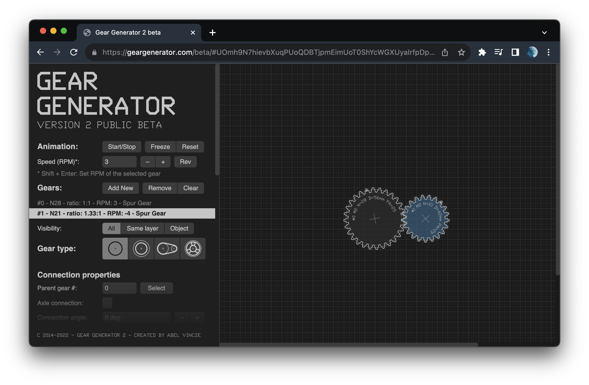
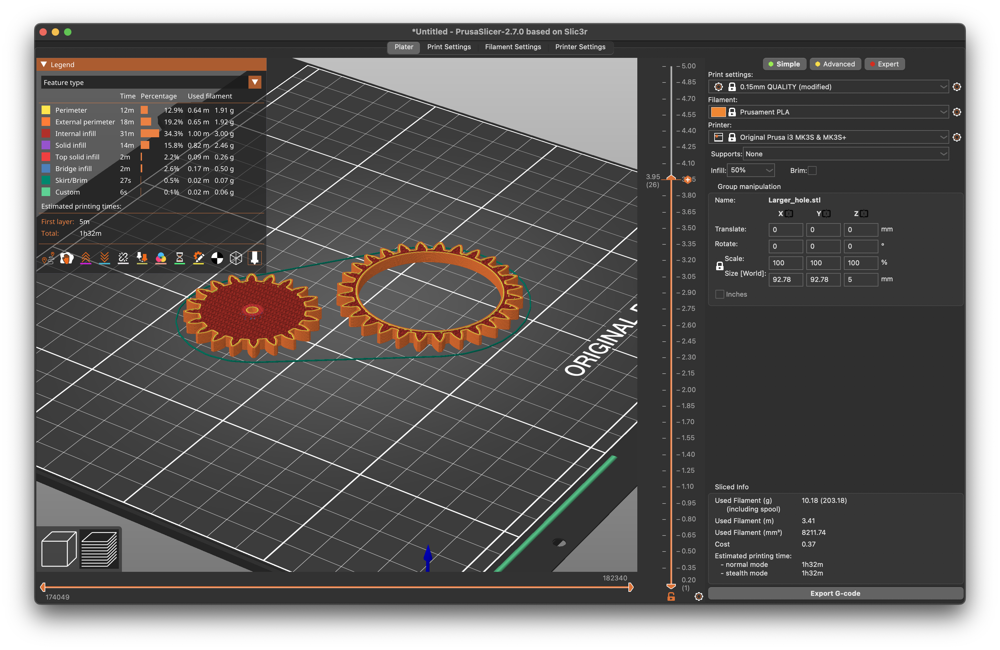
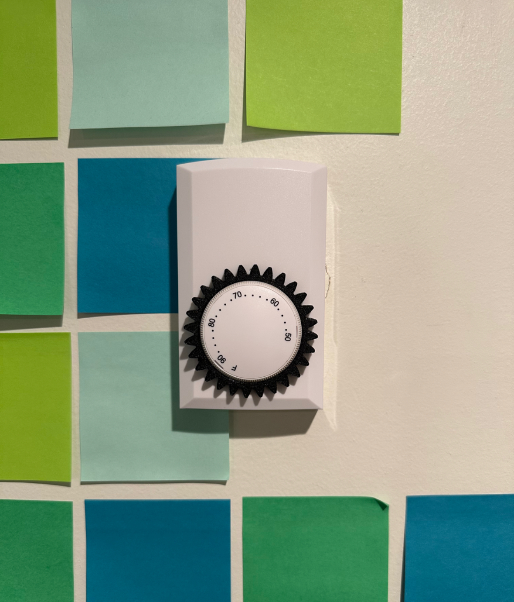
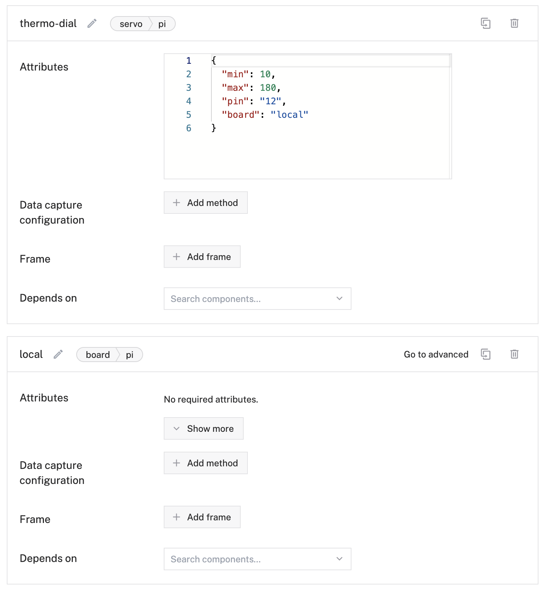
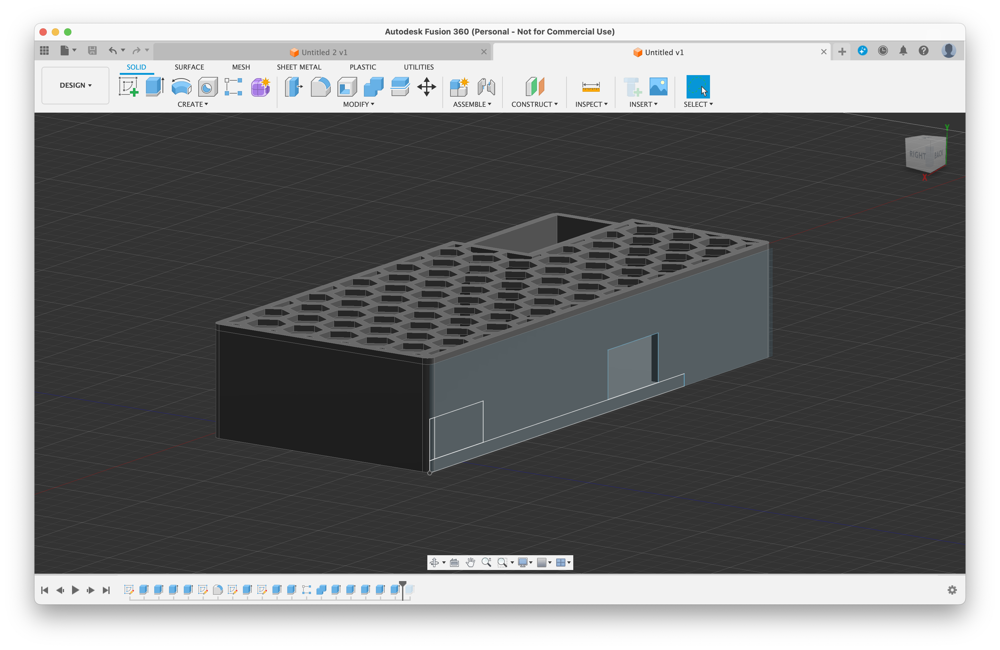
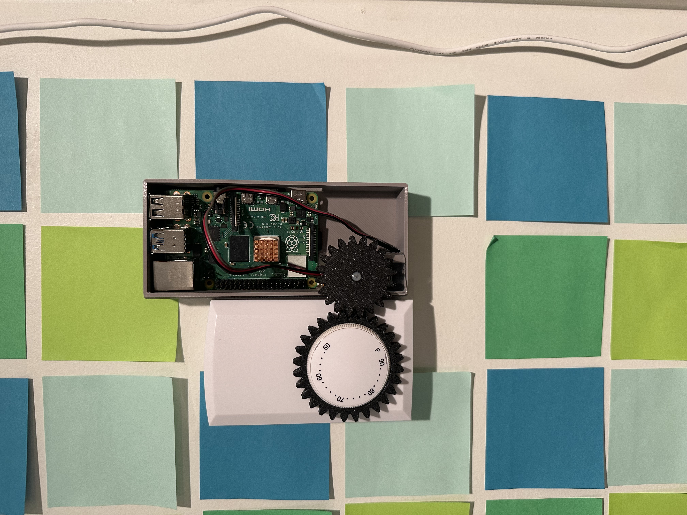
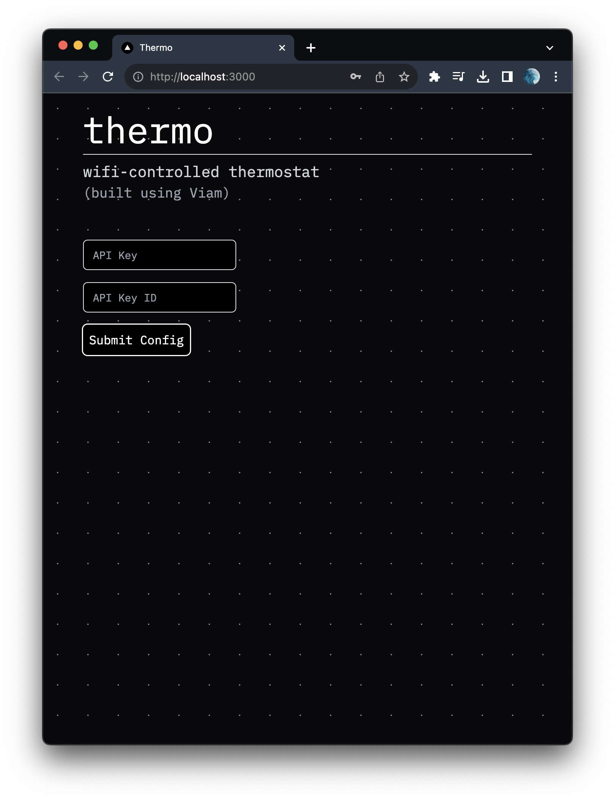
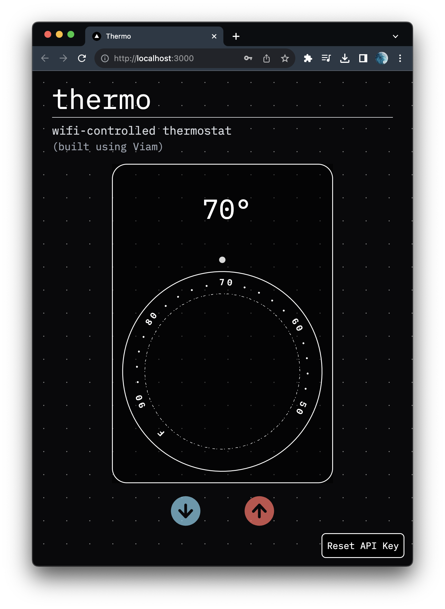

# 24 Hours to Fix My Thermostat (With Viam)

- Jump to see the final results here: [Final Results](#final-results)

My thermostat has a problem: it is outdated, clunky and not connected to the internet. My goal is to try to fix that by building a smart machine. In the process, we'll take advantage of Viam to easily connect and control it over the internet.

Also, because of the upcoming finals week, we'll have to hack it together in 24 hours.

The first thing you'll notice is that my thermostat is mounted directly on my wall. (Yes, I do have sticky notes on my wall!) With my lease expiring soon and the weather getting colder, obviously the best course of action is to build an easily attachable smart machine for my thermostat.

My idea is to mount a servo directly next to the dial and connect the two using a gear system. The gear around the dial will simply be held in place by friction, with the rest of the enclosure attached to the thermostat using double-sided tape for easy future removal.

To make it a "smart" machine, we will use Viam's platform along with their TypeScript SDK. This will enable us to easily build out an interactive web application capable of sending commands to our thermostat!

## First Steps - 3D Modeling

I wanted to be able to test the viability early on, so I started off by prototyping the gears and will validate whether the servo is capable of overcoming the stiffness in the dial.

Since the thermostat dial can be difficult to turn at times, I decided to use a gear ratio of 1.33, giving us a little extra torque to hopefully ensure that our small servo doesn't struggle.

However, since the servo turns a maximum of 180 degrees, we can only rotate the dial itself about $180/1.33=135$ degrees. Ultimately, this translates to a selectable temperature range of 24°F, which is totally fine with me! I don't plan on selecting anything outside 60 to 84 °F.

(Future improvements could have a multi-turn servo or another servo with a wider range that enables selecting any temperature on the thermostat.)

After measuring out the dimensions and doing some 3D modeling work, we have some gears ready to print!

These do usually take a few tries to get right as the printer doesn't quite adhere to the precise dimensions, but fortunately, only one failed attempt later, we have a perfect fit around the thermostat!

  

## Viam Integration

My next step was getting the Raspberry Pi set up with `viam-server` and attempting to control the servo's angle.

  

The documentation with specific instructions for the Raspberry Pi was simple to follow, and after installing a few updates, I was up and running in a matter of minutes.

In this case, I called my robot 'thermo' and initialized components for the board itself as well as the servo.

The developer experience throughout the process felt seamless, and each question I ran into had detailed documentation on the site. I thoroughly enjoyed setting up Viam as the platform felt refined, and although this robot is simple, it's easy to see how a more complex robot could be built up from different components and services.

https://github.com/agavram/thermo/assets/17835438/e837d71f-5ea1-4bc8-aed6-06a8654917c7

Here you can see me testing the servo moving between different angles. Furthermore, I was able to verify the servo's strength by holding it against the dial to test whether the servo would in fact cause it to spin. Although the servo appears small, luckily it's more than strong enough!

## Enclosure Construction

Encouraged by the servo's movement, it was time to build an enclosure to mount my smart machine, consisting of the Raspberry Pi and servo, alongside the thermostat. This would be the final construction step, and afterward the only remaining piece is the web application.

A few more hours of 3D modeling work later, and we have a simple yet functional enclosure to hold everything together. (The hexagonal pattern on top nearly crashed my computer, but it was worth it!)

## Putting It All Together

The following morning, with the 3D print complete and time ticking down, I placed the components inside the enclosure and mounted it beside my thermostat. (Gorilla double-sided tape was enough to easily adhere it.) As the gears interlinked together, I was ready to power on my robot and never manually adjust my thermostat again!

  

https://github.com/agavram/thermo/assets/17835438/45e27d12-bc98-4dfd-9537-5ba1e0d9ddbb

We've now successfully built a robot capable of remotely adjusting the temperature in my room for me! We could call it complete at this point since the Viam mobile app allows us to configure the servo angle, however, I want to try out the Viam TypeScript SDK and build out a sleek UI to check/set the temperature.

## Thermo Web App

The website code is all contained in this repository! I would encourage anyone interested to take a look and poke around. The frontend is using Next.js and Tailwind.

My initial brainstorm for the UI was to create a digital representation of the thermostat dial, reflecting its real-world state. In addition, I'll add some buttons for sending commands to adjust the temperature in my room by adjusting the servo angle.

In the spirit of a hackathon and with finals week closely looming, I decided on a UI that was minimal but still accomplished the necessary goals.

  

On opening the site, we are greeted with a page asking for your API Key and API Key ID. With the valid credentials provided, we see a virtual representation of the physical thermostat in my room!

  

The currently set temperature and the dial's current position are visible, all based on the servo angle data fetched through the SDK. As we press the buttons to select a new temperature, we can see the animation as it spins to our desired position. All of this happens instantly, reflecting the actual thermostat's position in my room.

https://github.com/agavram/thermo/assets/17835438/192c04e7-7e2f-4bf3-a26f-d1b6fad8c4ff

This is made possible by the Viam TypeScript SDK, which creates a low-latency WebRTC connection directly to the Raspberry Pi, in turn sending the necessary signals to move the servo. The boilerplate provided under the "Code sample" tab was immensely helpful in getting started, and the available methods for moving and getting the servo position were intuitive. In a few minutes after installing the TypeScript SDK into my project, I had the servo successfully moving.

## Final Results

Here is the final result and a full side-by-side of my actual thermostat being controlled by the web application. The clicks on the UI are nearly instantaneously sent to the servo. No more needing to get out of bed on a cold night to dial up the temperature!

https://github.com/agavram/thermo/assets/17835438/660da684-6cd4-413e-8f42-ffb2f3f8f5d7

## Closing Notes

With the assistance of Viam, I was able to focus my attention fully on the construction of the robot and the web application. Details such as how to move a servo through PWM were already solved, and in addition, Viam's platform allowed for a flawless WebRTC connection with easy-to-use methods for getting and setting the servo angle. In fact, for testing the servo's movement, no code was required whatsoever! Ultimately, Viam enabled a pace of development that would otherwise be impossible, allowing the project to be completed in less than 24 hours.

I still need to try out many new features, like the Modular Registry ecosystem, but based on the experience I've had with this project alone, it makes me excited to see where Viam is headed. There doesn't seem to be any other company with the same ambitious mission and it's been inspiring to hear about the different potential future applications, from ocean cleanup to agriculture automation. I've barely scratched the surface of Viam, and I hope to use it again soon!

## Future Directions

Another flaw in my thermostat is the inadequate temperature sensor. It is incorrect to within a few degrees, which is enough to make the room uncomfortably hot / cold. Integrating a more accurate sensor with thermo will allow it to autonomously dial the thermostat up when the room needs to be heated and otherwise set the thermostat off.

### Links to Software Used

- [Viam - Software platform for smart machines](https://www.viam.com/)
- [Next.js - React Framework for the Web](https://nextjs.org/)
- [Gear Generator](https://geargenerator.com/)
- [Fusion 360 (Modeling)](https://www.autodesk.com/products/fusion-360/personal)
- [PrusaSlicer (Printing)](https://www.prusa3d.com/page/prusaslicer_424/)
